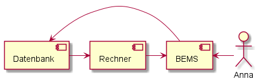
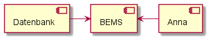

[[section-system-scope-and-context]]
== Kontextabgrenzung

Dieser Abschnitt beschreibt das Systems BEMS. Wie funktioniert BEMS. Was macht BEMS und wie spielt es mit den einzelnen Komponenten zusammen.

==== Anna

==== BEMS

==== Datenbank

=== Fachlicher Kontext

[role="arc42help"]

==== Anna

==== BEMS

==== Datenbank

**<optional: Erläuterung der externen fachlichen Schnittstellen>**

=== Technischer Kontext

==== Anna

==== BEMS

==== Datenbank

image::image-2021-05-19-13-35-51-425.png[]

**<optional: Erläuterung der externen technischen Schnittstellen>**

**<Mapping fachliche auf technische Schnittstellen>**
