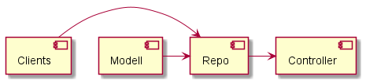
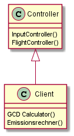
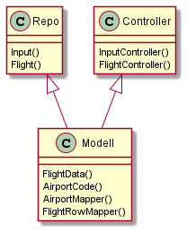
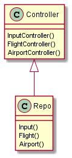

[[section-building-block-view]]
== Bausteinsicht

Dieser Abschnitt beschreibt die Zerlegung von BEMS in Komponenten, dies spiegelt sich auch in unserem Java Quellcode wieder. Die folgene Grafik zeigt die Abhängigkeiten untereinander.

[role="arc42help"]
****

|===
|Subsystem  |Kurzbeschreibung

|Clients
|Rechnung

|Modell
|modelliert Inhalte der Datenbank

|Repo
|stellt einzelne Reposotories dar

|Controller
|nutzt gegebene Daten & wandelt sich in API um
|===

****
=== Clients
==== Zweck und Verantwortlichkeit:
Dieses Subsytem ist zuständig für die Berechnung sowohl für die Distanz mithilfe der GCD als auch für die Emissionen. Die Ergebnisse die hierbei entstehen gibt der Client an den Controller weiter um spezifischer zu sein an den Flight und Input Controller

==== Schnittstellen

|===
|Methode |Kurzbeschreibung

|GCD
|berechnet die Distanz

|Emissionsrechner
|berechnet mit hilfe des GCD die Emissionen aus
|===

==== Ablageort/ Datei

==== Offene Punkte

=== Modell
==== Zweck und Verantwortlichkeit:
Dieses Subsytem ist zuständig für die Modellierung des ganzes Systems. Schnittstelle ist hier mit dem Repo und dem Controller.

==== Schnittstellen

|===
|Methode |Kurzbeschreibung

|FlightData
|stellt die Flughäfen

|AirportCode
|DatenbankDarstellung des IATA Code

|AirportMapper
|Mappt auf

|FlightRowMapper
|mappt auf
|===

==== Ablageort/ Datei

==== Offene Punkte

=== Repo
==== Zweck und Verantwortlichkeit:
Dieses Subsytem ist zuständig für die Reposotries zuständig. Hier ist ein Laden und Speichern von Daten möglich.

==== Schnittstellen

|===
|Methode |Kurzbeschreibung

|Airport
|gibt Airport Daten weiter

|Flight
|gibt bestehende Flugdaten weiter

|Input
|bestehende Input Daten werden weitergegeben
|===

==== Ablageort/ Datei

==== Offene Punkte

=== Controller
==== Zweck und Verantwortlichkeit:
Dieses Subsytem ist zuständig für die berechneten Daten. Auch ist dies der letzte Stein in unserem Ablauf. Dieses Subsytem wird anschliesend unsere API.

==== Schnittstellen

|===
|Methode |Kurzbeschreibung

|Airport Controller
|wandelt die Daten um

|Input Controller
|wandelt die Daten um

|Flight Controller
|wandelt die Daten um

|File Controller
|wandelt die Daten um

|===

==== Ablageort/ Datei

==== Offene Punkte
