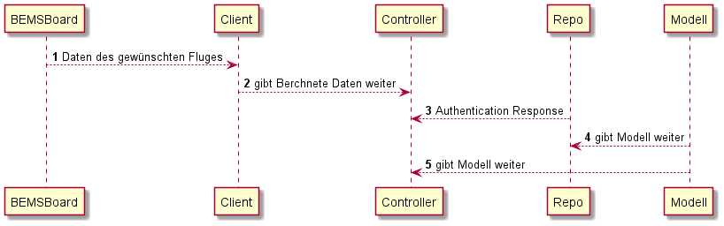

[[section-runtime-view]]
== Laufzeitsicht

[role="arc42help"]
****
.Inhalt
Diese Sicht visualisiert im Gegensatz zur statischen Bausteinsicht dynamische Aspekte. Wie spielen die Teile zusammen?

****

==== Berechnung eines Fluges

Zuerst gibt das Board die zu berechneten Daten an den Controller weiter, dieser tut mir hilfe des Controllers welcher mit dem GCD zuerst die Distanz anschließend die Emission ausrechnet.  Parallel dazu stellt die Repo dem Controller die Reposotories dar die der Rechner braucht, um den IATA- Code zu entwerten. Mitlfe der Modellierung kommt es zu keine Fehlern beim Format.
